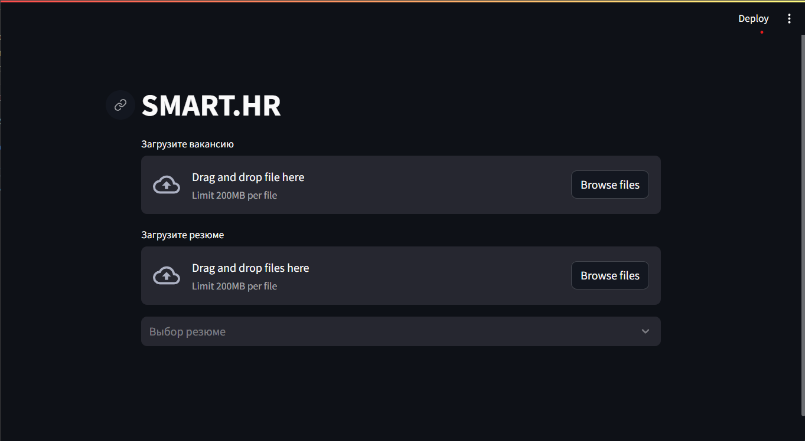
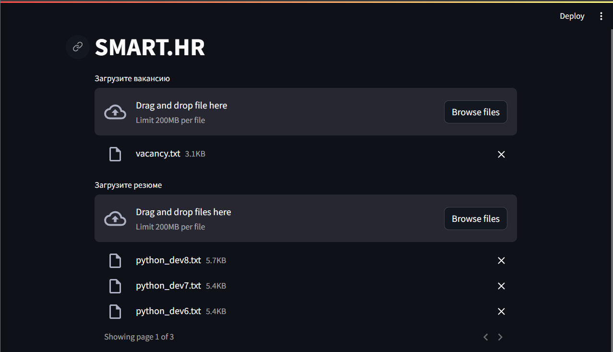
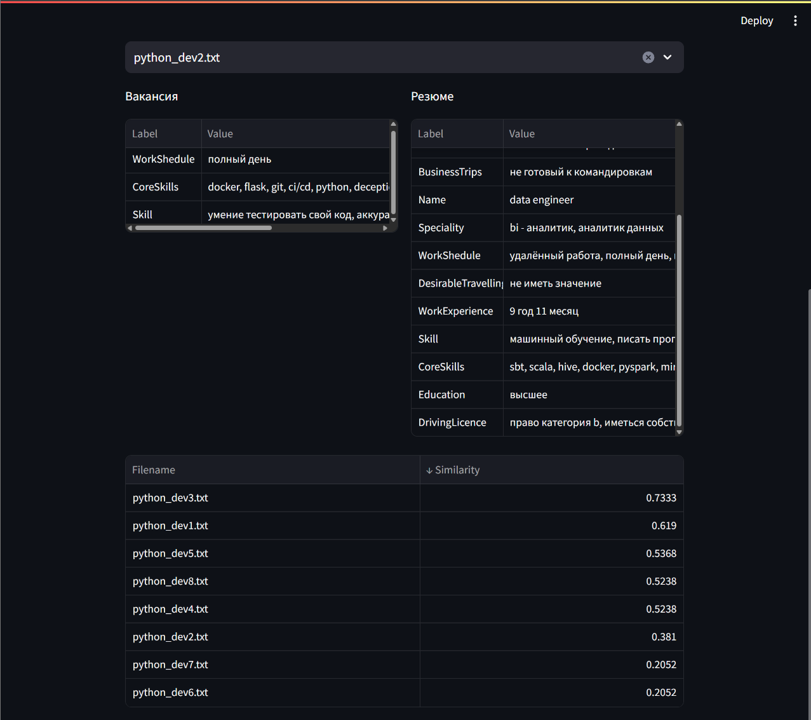

# SMART.HR - Интеллектуальный помощник для HR-специалистов



## О проекте

SMART.HR - это инновационное решение для автоматизации процесса подбора персонала, использующее современные технологии обработки естественного языка и машинного обучения. Система помогает HR-специалистам эффективно анализировать резюме и сопоставлять их с требованиями вакансий, экономя время и повышая качество подбора персонала.

## Ключевые возможности

### 🎯 Точное извлечение сущностей
- Автоматическое определение ключевых параметров из резюме и вакансий
- Распознавание навыков, опыта работы, образования и других важных характеристик
- Поддержка русского языка с учетом специфики HR-терминологии

### 📊 Умный анализ соответствия
- Расчет косинусного сходства между требованиями вакансии и компетенциями кандидатов
- Взвешенная оценка различных параметров для более точного ранжирования
- Визуализация результатов анализа в удобном формате

### 🚀 Простой и понятный интерфейс
- Интуитивно понятный веб-интерфейс на базе Streamlit
- Возможность загрузки нескольких резюме одновременно
- Мгновенный анализ и представление результатов



## Как это работает

1. **Загрузка данных**
   - Загрузите текст вакансии в формате "txt"
   - Добавьте одно или несколько резюме для анализа в формате "txt"

2. **Автоматический анализ**
   - Система извлекает ключевые сущности по тэгам из текстов
   - Производит сопоставление параметров 
   - Рассчитывает метрики сходства и ранжирует

3. **Результаты**
   - Получите детальный анализ соответствия
   - Просмотрите выделенные сущности
   - Оцените ранжированный список кандидатов



## Технические особенности

- Использование предобученной модели SpaCy для вакансий и резюме (NER)
- Применение TF-IDF и косинусного сходства для анализа текстов
- Взвешенная система оценки различных параметров
- Поддержка различных форматов документов

## Получение доступа

Доступ к nlp_model в данный момент исключительно в демонстрационном виде. Файлы обученной модели временно не предоставляются

## Требования к системе

- Python 3.10+, но < 3.12!
- Streamlit
- SpaCy
- Pandas
- Scikit-learn

## Установка и запуск

```bash
# Клонирование репозитория
git clone https://github.com/your-username/smart-hr.git

# Установка зависимостей
pip install -r requirements.txt

# Запуск приложения
streamlit run streamlitui.py
```

## Преимущества использования SMART.HR

- **Экономия времени**: Автоматизация рутинных задач по анализу резюме
- **Повышение качества**: Объективная оценка соответствия кандидатов
- **Масштабируемость**: Возможность обработки большого количества резюме
- **Гибкость**: Настраиваемые веса для различных параметров оценки

## Ограничения

- Система работает только с текстовыми данными (скачивайте сразу в .txt, а не в .pdf)
- На данный момент размечено порядка 7000 резюме разработчиков (Java, Python, C++, Web, etc.)
- Требуется предварительная разметка данных и обучение модели для специфических доменов и профессий
- Необходимость четкого согласования тегов, сущностей, вариативности при разметке текста.
- Точность анализа зависит от качества входных данных

## Контакты

Для получения дополнительной информации, демонстрации системы или обсуждения условий использования, пожалуйста, свяжитесь с нами:

- TG: [adamgrotti](https://t.me/adamgrotti)
- Телефон: HIDDEN

## Лицензия

© 2024 SMART.HR. Все права защищены.


